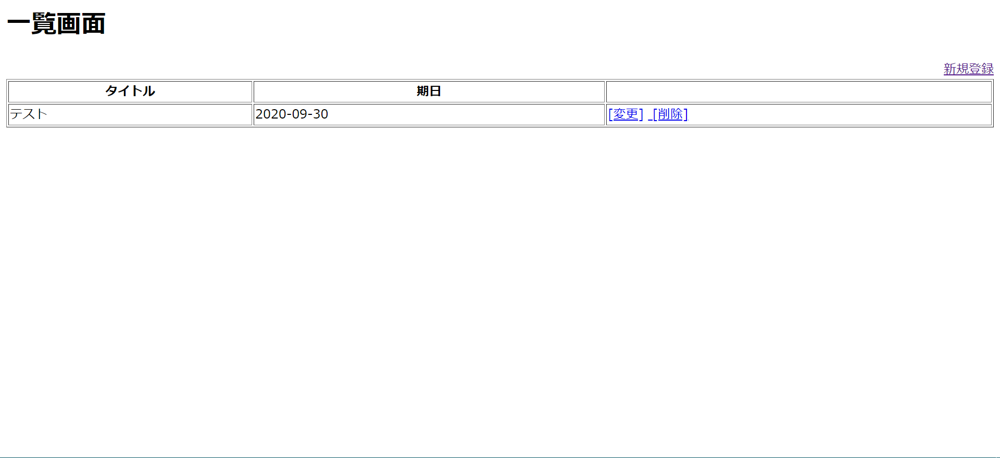
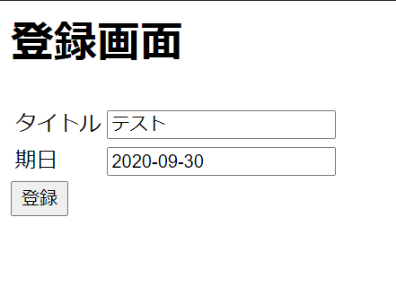

<h1>remind_web<h1>
<h3>初めて作成したwebアプリケーションです。<h3>

 
この画面には登録したリマインドの一覧が表示されます。[変更]をクリックするとリマインドの編集が、 
[削除]をクリックするとリマインドを削除することができます。 
新規登録 をクリックすると下の画面に遷移します。 
 
この画面でリマインドを登録、編集することができます。

HTML PHP

